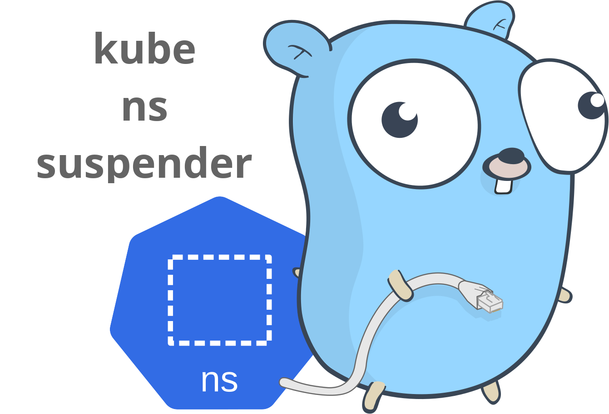
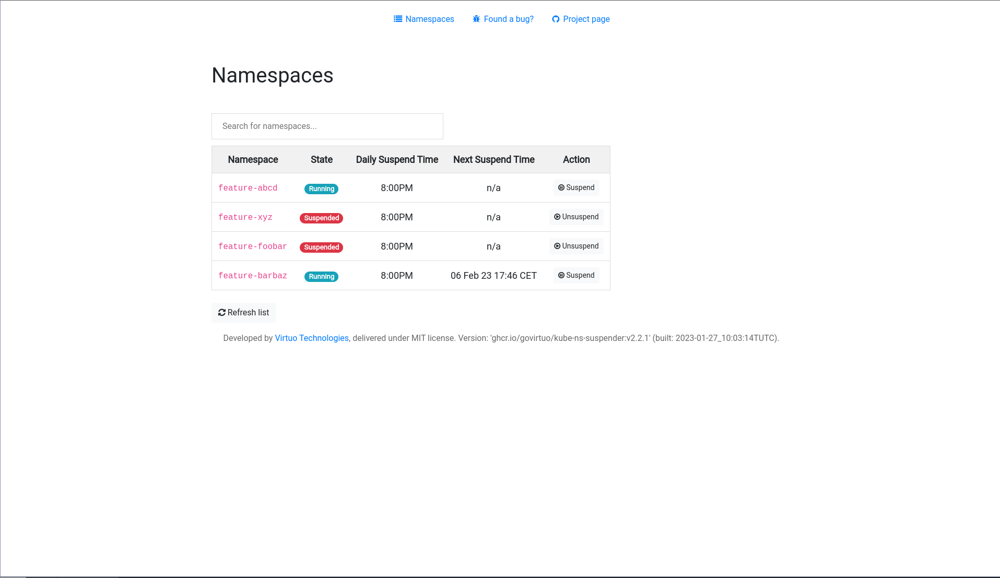
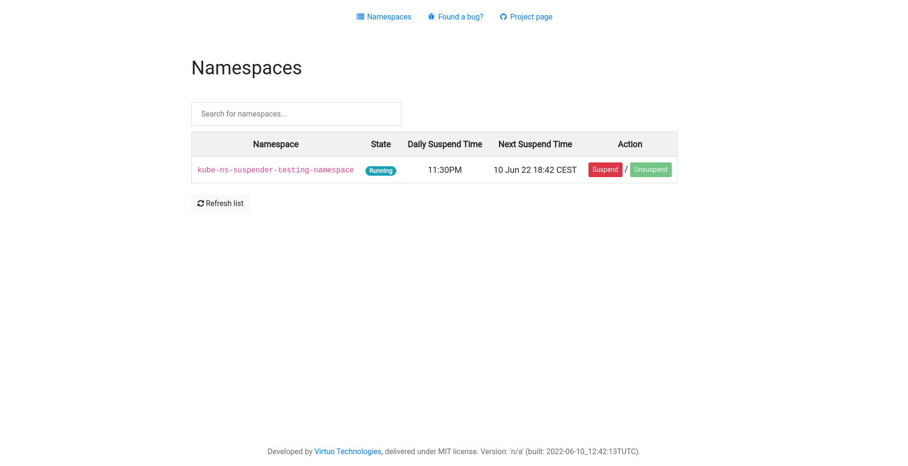
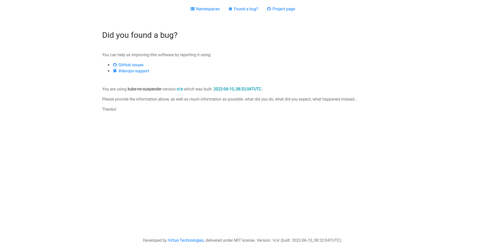

# kube-ns-suspender



Kubernetes controller managing namespaces life cycle.

- [kube-ns-suspender](#kube-ns-suspender)
  - [Goal](#goal)
  - [Installation](#installation)
  - [Usage](#usage)
    - [Internals](#internals)
      - [The watcher](#the-watcher)
      - [The suspender](#the-suspender)
    - [Flags](#flags)
    - [Resources](#resources)
    - [States](#states)
    - [Annotations](#annotations)
      - [On namespaces](#on-namespaces)
        - [**controllerName**](#controllername)
        - [**dailySuspendTime**](#dailysuspendtime)
        - [**desiredState**](#desiredstate)
        - [**nextSuspendTime**](#nextsuspendtime)
      - [On resources](#on-resources)
        - [Deployments and Stateful Sets](#deployments-and-stateful-sets)
        - [Cronjobs](#cronjobs)
    - [Metrics](#metrics)
    - [Profiling](#profiling)
  - [WebUI screenshots](#webui-screenshots)
  - [Development flow](#development-flow)
  - [Testing](#testing)
  - [Contributing](#contributing)
  - [License](#license)

## Goal

This controller watches the cluster's namespaces and "suspends" them by scaling to 0 some of the resources within those namespaces at a given time.
However, once a namespace is in a "suspended" state, it will not be restarted automatically the following day (or whatever). This allows to "reactivate" namespaces only when required, and reduce costs.

## Installation

To deploy `kube-ns-suspender`, run the following commands:

```
kubectl create ns kube-ns-suspender && \
kubectl apply -f manifests/run/base/
```

This will apply all the required resources.

> :memo:
> 
> The latest version of `kube-ns-suspender` will be deployed as the image tag used is `:latest`.

A namespace `kube-ns-suspender` will be created and the manifests will be deployed within.

## Usage

### Internals

This controller can be splitted into 2 parts:

* The watcher
* The suspender

#### The watcher

The watcher function is charged to check every X seconds (X being set by the flag `--watcher-idle` or by the `KUBE_NS_SUSPENDER_WATCHER_IDLE` environement variable) all the namespaces. When it found namespace that have the `kube-ns-suspender/controllerName` annotation, it sends it to the suspender. It also manages all the metrics that are exposed about the watched namespaces states.

#### The suspender

The suspender function does all the work of reading namespaces/resources annotations, and (un)suspending them when required.

### Flags

| Flag                   | Description                                       |      Default      | Environment variable                   |
| ---------------------- | ------------------------------------------------- | :---------------: | -------------------------------------- |
| `--controller-name`    | Unique name of the controller                     | kube-ns-suspender | `KUBE_NS_SUSPENDER_CONTROLLER_NAME`    |
| `--human`              | Disable JSON logging                              |       false       | `KUBE_NS_SUSPENDER_HUMAN`              |
| `--log-level`          | Log level                                         |       debug       | `KUBE_NS_SUSPENDER_LOG_LEVEL`          |
| `--no-kube-warnings`   | Disable Kubernetes warnings                       |       false       | `KUBE_NS_SUSPENDER_NO_KUBE_WARNINGS`   |
| `--pprof`              | Start pprof server                                |       false       | `KUBE_NS_SUSPENDER_PPROF`              |
| `--pprof-addr`         | Address and port to use with pprof                |       :4455       | `KUBE_NS_SUSPENDER_PPROF_ADDR`         |
| `--prefix`             | Prefix to use for annotations                     | kube-ns-suspender | `KUBE_NS_SUSPENDER_PREFIX`             |
| `--running-duration`   | Running duration                                  |        4h         | `KUBE_NS_SUSPENDER_RUNNING_DURATION`   |
| `--slack-channel-link` | Link of the help Slack channel in the UI bug page |        ""         | `KUBE_NS_SUSPENDER_SLACK_CHANNEL_LINK` |
| `--slack-channel-name` | Name of the help Slack channel in the UI bug page |        ""         | `KUBE_NS_SUSPENDER_SLACK_CHANNEL_NAME` |
| `--timezone`           | Timezone to use                                   |   Europe/Paris    | `KUBE_NS_SUSPENDER_TIMEZONE`           |
| `--ui-embedded`        | Start UI in background                            |       false       | `KUBE_NS_SUSPENDER_UI_EMBEDDED`        |
| `--ui-only`            | Start UI only                                     |       false       | `KUBE_NS_SUSPENDER_UI_ONLY`            |
| `--watcher-idle`       | Watcher idle duration in seconds                  |        15         | `KUBE_NS_SUSPENDER_WATCHER_IDLE`       |

### Resources

Currently supported resources are:

* [deployments](#deployments-and-stateful-sets)
* [stateful sets](#deployments-and-stateful-sets)
* [cronjobs](#cronjobs)

### States

Namespaces watched by `kube-ns-suspender` can be in 2 differents states:

* Running: the namespace is "up", and all the resources have the desired number of replicas.
* Suspended: the namespace is "paused", and all the supported resources are scaled down to 0 or suspended.

### Annotations

We assume here that the prefix used (`--prefix`) is the one by default.

#### On namespaces

##### **controllerName**

In order for a namespace to be watched by the controller, it needs to have the `kube-ns-suspender/controllerName` annotation set to the same value as  `--controller-name`.

Then, the namespace will be attributed a state, which can be either `Running` or `Suspended` (depending if `kube-ns-suspender/dailySuspendTime` is past).

##### **dailySuspendTime**

To be automatically suspended at a given time, a namespace must have the annotation `kube-ns-suspender/dailySuspendTime` set to a valid value.
Valid values are any values that match the [`time.Kitchen`](https://pkg.go.dev/time#pkg-constants) time format, for example: `8:15PM`, `12:45AM`...

##### **desiredState**
 
If you want to unsuspend a namespace, you have to edit the annotation of the namespace:

`kube-ns-suspender/desiredState: Suspended` -> `kube-ns-suspender/desiredState: Running`.

To do this, you can either use the webui, do it manually with `kubectl edit` or use the dedicated [`kubectl` plugin](https://github.com/govirtuo/kubectl-suspender).

##### **nextSuspendTime**

When unsuspending a namespace, a new annotation will be added automically: `kube-ns-suspender/nextSuspendTime`.

This annotation contains the date at which the namespace will be automatically suspended again (following the format [`time.RFC822Z`](https://pkg.go.dev/time#pkg-constants)). The default value set by the controller can be tweaked with the flag `--running-duration`. The annotation value can also be edited manually if needed.

> :memo:
>
> `dailySuspendTime` has a higher priority than `nextSuspendTime`
>

#### On resources

Annotations are employed to save the original state of a resource. 

##### Deployments and Stateful Sets

As those resources have a `spec.replicas` value, they must have a `kube-ns-suspender/originalReplicas` annotation that must be the same as the `spec.replicas` value. This annotation will be used when a resource will be "unsuspended" to set the original number of replicas.

##### Cronjobs

Cronjobs have a `spec.suspend` value that indicates if they must be runned or not. As this value is a boolean, **no other annotations are required**.

### Metrics

`kube-ns-suspender` comes with its own Prometheus exporter. It starts automatically and listens on `0.0.0.0:2112` by default.

### Profiling

`kube-ns-suspender` can start a pprof server for profiling, using the flag `--pprof`. 

## WebUI screenshots

> :memo
>
> The webUI is **disabled** by default.

Since version `v2.1.0`, you can both suspend and unsuspend a namespace from the web UI. It is also possible to specify a custom Slack channel using `--slack-channel-name` and `--slack-channel-link` (and their associated env vars). If only the link is provided, nothing will appear, but if there is only the name the Slack channel name will appear but will not be clickable. By default, only the link to the GitHub issues appears.

<details>
<summary>Click to see some screenshots</summary>







</details>

## Development flow

To test the modifications in real-time, this project uses [`devspace`](https://devspace.sh/). It is configured to use the manifests in `manifests/dev/`.

> :bulb:
>
> * You can start a local Kubernetes cluster with the command: `make kind-start`
> * Then run in your shell `export KUBE_CONFIG=` the value reported :point_up:

First, set the namespace to use:

```
devspace use namespace kube-ns-suspender-testing
```

Deploy the testing namespace with mock resources:

```
kubectl apply -f manifests/testing-namespace
```
****
Then deploy your dev version of `kube-ns-suspender`:

```
devspace dev
```

> :warning:
> 
> `devspace` and `kubectl` will deploy the manifests in the cluster set by the current context. be sure to **not** deploy in the wrong cluster.
>

Once the dev deployment is over, you'll have access to a shell in the container. You can start developing!

When you are done, you can stop everything by closing your shell in the container and running:

```
devspace purge
```

and:

```
kubectl delete -f manifests/testing-namespace/
```

## Testing

The controller at each PR and push using [bats-detik](https://github.com/bats-core/bats-detik).

## Contributing

/* add CONTRIBUTING file at root */

## License

[MIT](https://choosealicense.com/licenses/mit/)
