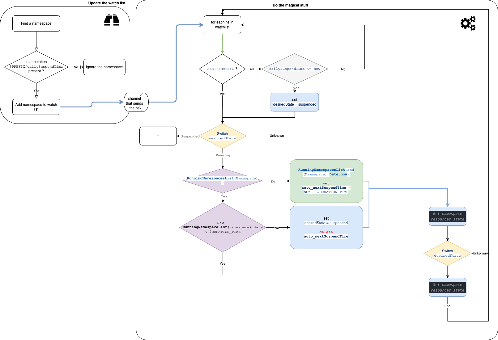

# kube-ns-suspender

V1

<a href="https://app.diagrams.net/#Uhttps%3A%2F%2Fraw.githubusercontent.com%2Fgovirtuo%2Fkube-ns-suspender%2Fmain%2Fdocs%2Farchitectures%2Fassets%2F1-v1.png" target="_blank">Edit As New</a> | <a href="https://app.diagrams.net/#Hgovirtuo%2Fkube-ns-suspender%2Fmain%2Fdocs%2Farchitectures%2Fassets%2F1-v1.png" target="_blank">Edit in diagrams.net</a>